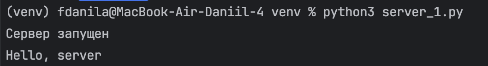

# Задание 1

## Задание:
Реализовать клиентскую и серверную часть приложения. Клиент отправляет серверу сообщение «Hello, server», и оно должно отобразиться на стороне сервера. В ответ сервер отправляет клиенту сообщение «Hello, client», которое должно отобразиться у клиента.

**Требования**

- Обязательно использовать библиотеку socket.
- Реализовать с помощью протокола UDP.

### Выполнение
**server_1.py**
```
import socket

server_socket = socket.socket(socket.AF_INET, socket.SOCK_DGRAM)
```
В первострочке импортируем socket
Дальше создаем UDP сокет. 
Используем: 
`AF_INET` — семейство адресов IPv4;
`SOCK_DGRAM` — тип датаграмм (UDP), без установления соединения.

```
server_socket.bind(('localhost', 1234))
```
Биндим хост и порт
print('Сервер запущен')

```while True:
    data, address = server_socket.recvfrom(1024)
    print(f'{data.decode()}')
    server_socket.sendto(b'Hello, client', address)
```

`recvfrom(1024)` - ожидание одной UDP датаграммы размером до 1024 байт, которое возращает кортеж данных(данные, адрес отправителя)
`data.decode()` - перевод байт в строку(utf-8) и вывод на сервере
`send_to(..., address)` - отправка ответа на адрес отправителя

client_1.py
```
import socket

client_socket = socket.socket(socket.AF_INET, socket.SOCK_DGRAM)

server_address = ('localhost', 1234)
```

```
client_socket.sendto(b'Hello, server', server_address)
```
Отправка датаграммы на сервер (байты).

```
data, address = client_socket.recvfrom(1024)
print(f'{data.decode()}')
```
Получение ответа от сервера

#### Результаты
**Сервер**


**Клиент**


