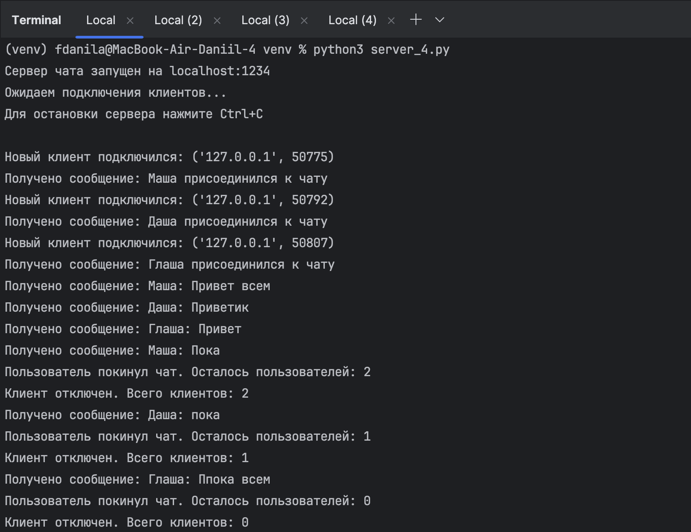

# Задание 4

## Задание:

Реализовать двухпользовательский или многопользовательский чат. Для максимального количества баллов реализуйте многопользовательский чат.

**Требования**

- Обязательно использовать библиотеку socket.
- Для многопользовательского чата необходимо использовать библиотеку threading.

### Выполнение

**server_4.py**

```
    import socket
    import threading

    server_socket = socket.socket(socket.AF_INET, socket.SOCK_STREAM)

    # Разрешаем повторное использование адреса (для быстрого перезапуска сервера)
    server_socket.setsockopt(socket.SOL_SOCKET, socket.SO_REUSEADDR, 1)

    server_socket.bind(('localhost', 1234))
    server_socket.listen(5)
```

- Создаём TCP-сокет (`SOCK_STREAM`).
- Настроим повторное использование адреса с помощью `setsockopt` (чтобы можно было быстро перезапустить сервер).
- Привязываем сокет к адресу localhost и порту 1234.
- Слушаем до 5 одновременных подключений.

```
    client_sockets = set()  # Множество для хранения всех подключенных клиентских сокетов
    client_sockets_lock = threading.Lock()
```

- `client_sockets_lock` — блокировка для синхронизации доступа к этому множеству из разных потоков.

```
    def listen_client(client_socket):#Функция для обработки сообщений от конкретного клиента вызывается в отдельном потоке для каждого клиента

        try:
            while True:
                message = client_socket.recv(1024).decode('utf-8')# Получаем сообщение от клиента

                if not message:# Если сообщение пустое, клиент отключился
                    break

                print(f"Получено сообщение: {message}")

                with client_sockets_lock:
                    clients_copy = client_sockets.copy()

                for other_client in clients_copy: # Рассылаем сообщение всем остальным клиентам
                    if other_client != client_socket:  # Не отправляем обратно отправителю
                        try:
                            other_client.send(message.encode('utf-8'))
                        except Exception as e:# Если отправка не удалась, клиент вероятно отключился
                            print(f"Ошибка отправки клиенту: {e}")
                            with client_sockets_lock:
                                client_sockets.discard(other_client)

        except Exception as e:
            print(f"Ошибка при работе с клиентом: {e}")
        finally:# При отключении клиента удаляем его из множества и закрываем соединение
            with client_sockets_lock:
                if client_socket in client_sockets:
                    client_sockets.discard(client_socket)
            leave_msg = f"Пользователь покинул чат. Осталось пользователей: {len(client_sockets)}"
            print(leave_msg)
            broadcast_message(leave_msg)
            try:
                client_socket.close()
            except:
                pass

            print(f"Клиент отключен. Всего клиентов: {len(client_sockets)}")
```

- Эта функция обрабатывает сообщения от конкретного клиента. Каждый клиент обрабатывается в отдельном потоке.
- Клиент может отправить сообщение, которое будет передано всем остальным пользователям.
- Если соединение с клиентом обрывается, его сокет удаляется из множества.

```
    def broadcast_message(message, sender_socket=None)
        with client_sockets_lock:
            clients_copy = client_sockets.copy()

        for client in clients_copy:
            if client != sender_socket:  # Не отправляем сообщение отправителю
                try:
                    client.send(message.encode('utf-8'))
                except:# Если отправка не удалась, удаляем клиента
                    with client_sockets_lock:
                        client_sockets.discard(client)
```

- Эта функция рассылает сообщение всем клиентам, кроме отправителя (если указан sender_socket).

```
    print("Сервер чата запущен на localhost:1234")
    print("Ожидаем подключения клиентов...")
    print("Для остановки сервера нажмите Ctrl+C\n")
```

```
    try:
        while True:
            client_socket, client_address = server_socket.accept()
            print(f'Новый клиент подключился: {client_address}')

            with client_sockets_lock:# Добавляем клиента в множество
                client_sockets.add(client_socket)

            client_thread = threading.Thread(target=listen_client,args=(client_socket,))# Создаем и запускаем поток для обработки клиента
            client_thread.daemon = True # Делаем поток демоном (завершится при завершении основного потока)
            client_thread.start()

            welcome_msg = "Добро пожаловать в чат! Вы подключились к серверу."# Отправляем приветственное сообщение новому клиенту
            client_socket.send(welcome_msg.encode('utf-8'))

            join_msg = f"Новый пользователь присоединился к чату. Всего пользователей: {len(client_sockets)}"# Уведомляем всех о новом подключении
            broadcast_message(join_msg, client_socket)

    except KeyboardInterrupt:
        # Обрабатываем прерывание Ctrl+C для корректного завершения
        print("\nОстанавливаем сервер...")
    finally:
        print("Закрываем все соединения...")# Закрываем все соединения при завершении работы

        with client_sockets_lock:# Закрываем все клиентские сокеты
            for client_socket in client_sockets:
                try:
                    client_socket.close()
                except:
                    pass
            client_sockets.clear()

        server_socket.close()
        print("Сервер остановлен.")
```

- server_socket.accept(): Этот метод блокирует выполнение программы и ждёт, пока клиент не подключится. 

Как только клиент подключается, метод возвращает два значения:

- client_socket: Новый сокет, предназначенный для общения с этим клиентом. Сервер будет использовать этот сокет для отправки и получения сообщений от клиента.
- client_address: IP-адрес и порт клиента.

После получения соединения сервер продолжает выполнять программу.

Сервер выводит в консоль сообщение о том, что новый клиент подключился, и показывает его адрес и порт.

Дальше клиент добавляется в множество `client_socket`, которое хранит все активные сокеты клиентов. Это множество используется для рассылки сообщений всем клиентам.

Для безопасного добавления клиентов в множество используется блокировка (`client_sockets_lock`), так как это множество может изменяться в разных потоках одновременно (например, когда клиент подключается или отключается).

**Создание потока**
- Для каждого клиента создаётся новый поток с помощью библиотеки `threading`. Это позволяет серверу обрабатывать сообщения от разных клиентов одновременно.

- `target=listen_client` - Это целевая функция потока, которая будет работать с этим конкретным клиентом. Внутри этой функции сервер будет ожидать сообщения от клиента и рассылать их остальным.

- `args=(client_socket,)` - Это аргументы, передаваемые в функцию `listen_client`. В данном случае передаём только сокет клиента, чтобы функция могла работать с ним.
- `daemon=True` - Делает поток демоном, то есть поток автоматически завершится, как только завершится основной поток программы (это упрощает завершение работы сервера).

При остановке сервера все клиентские сокеты закрываются, и сервер завершает свою работу.

**client_4.py**

```
    import socket
    import threading


    def receive_messages(client_socket): # Функция для получения сообщений от сервера
        try:
            while True:
                message = client_socket.recv(1024).decode('utf-8')
                if not message:
                    print("\nСоединение с сервером разорвано.")
                    break
                print(f"\n{message}")
                print("> ", end="", flush=True)
        except:
            print("\nОшибка соединения с сервером.")
```
- Если message пустое, это означает, что сервер закрыл соединение или что-то пошло не так. Клиент сообщает об этом и выходит из цикла.
- В случае ошибки в процессе получения сообщения выводится сообщение об ошибке соединения.
- Эта функция будет работать в отдельном потоке, чтобы клиент мог получать сообщения в фоновом режиме.

```
    def start_client(host='localhost', port=1234):
        client_socket = socket.socket(socket.AF_INET, socket.SOCK_STREAM)

        try:
            client_socket.connect((host, port)) # Подключаемся к серверу
            nickname = input("Введите ваш никнейм: ")# Запрашиваем никнейм у пользователя
            # Отправляем никнейм серверу как первое сообщение
            client_socket.send(f"{nickname} присоединился к чату".encode('utf-8'))
            print(f"\nДобро пожаловать в чат, {nickname}!")
            print("Для выхода введите 'exit' или нажмите Ctrl+C")

            receive_thread = threading.Thread(target=receive_messages, args=(client_socket,))# Запускаем поток для получения сообщений
            receive_thread.daemon = True
            receive_thread.start()

            while True: # Основной цикл отправки сообщений
                message = input("You: ")
                if message.lower() == 'exit':
                    break

                formatted_message = f"{nickname}: {message}" # Форматируем сообщение с ником
                client_socket.send(formatted_message.encode())

        except Exception as e:
            print(f"Ошибка: {e}")
        finally:
            client_socket.close()
            print("Выход из чата.")

    start_client()
```

- Создаём сокет с использованием TCP/IP (`SOCK_STREAM`).
- `client_socket.connect((host, port))` — клиент подключается к серверу по указанному адресу и порту.
- После подключения клиент запрашивает у пользователя его никнейм, который отправляется на сервер с помощью метода `client_socket.send()`. Сервер получает это сообщение и может уведомить других клиентов о новом пользователе.
- Затем создаётся новый поток, который запускает функцию `receive_messages`. Этот поток будет работать параллельно с основным циклом программы, что позволяет клиенту одновременно получать и отправлять сообщения.
- Следующим идет основной цикл отправки сообщений. Сообщение отправляется серверу через сокет с помощью `client_socket.send()`, и оно будет разослано другим подключённым пользователям.
- В случае возникновения ошибок (например, потеря соединения с сервером), клиент выводит сообщение об ошибке.
- Когда клиент завершает работу, сокет закрывается с помощью `client_socket.close()`.

#### Результаты

**Сервер**



**Пользователь 1**

**Пользователь 2**

**Пользователь 3**


