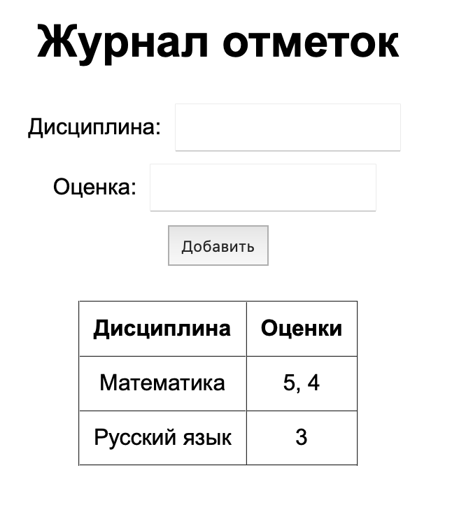

# Задание 5

## Задание: 

Написать простой веб-сервер для обработки GET и POST HTTP-запросов с помощью библиотеки socket в Python.

Сервер должен: Принять и записать информацию о дисциплине и оценке по дисциплине. Отдать информацию обо всех оценках по дисциплинам в виде HTML-страницы.

### Выполнение

**server_5.py**

```import socket
from urllib.parse import parse_qs

SERVER_HOST = "localhost"
SERVER_PORT = 1234

# Память сервера: "дисциплина" -> список оценок
grades_by_discipline = {}  # например: {"Математика": ["5", "4"]}

def build_html_page():
    table_rows = []
    if grades_by_discipline:
        for discipline, grades_list in grades_by_discipline.items():
            grades_text = ", ".join(grades_list) if grades_list else "—"
            table_rows.append(f"<tr><td>{discipline}</td><td>{grades_text}</td></tr>")
    else:
        table_rows.append("<tr><td colspan='2'>Нет данных</td></tr>")

    html_template = """<!DOCTYPE html>
<html lang="ru">
<head>
    <meta charset="UTF-8">
    <title>Журнал отметок</title>
    <style>
        body {{
            display: flex;
            flex-direction: column;
            align-items: center;
            min-height: 100vh;
            margin: 0;
            font-family: Arial, sans-serif;
        }}

        .container {{
            width: 80%;
            max-width: 800px;
            text-align: center;
        }}

        table {{
            margin: 20px auto;
            border-collapse: collapse;
        }}

        th, td {{
            padding: 10px;
            text-align: center;
        }}

        form {{
            margin: 20px 0;
        }}

        input, button {{
            padding: 8px;
            margin: 5px;
        }}
    </style>
</head>
<body>
    <div class="container">
        <h1>Журнал отметок</h1>

        <form action="/add" method="POST">
            <div>
                <label>Дисциплина: <input type="text" name="discipline"></label>
            </div>
            <div>
                <label>Оценка: <input type="text" name="grade"></label>
            </div>
            <div>
                <button type="submit">Добавить</button>
            </div>
        </form>

        <table border="1" cellpadding="6" cellspacing="0">
            <thead>
                <tr><th>Дисциплина</th><th>Оценки</th></tr>
            </thead>
            <tbody>
                {rows}
            </tbody>
        </table>
    </div>
</body>
</html>"""

    return html_template.format(rows=''.join(table_rows))

def read_http_request(client_socket):
    data = b""
    while b"\r\n\r\n" not in data:
        chunk = client_socket.recv(4096)
        if not chunk:
            break
        data += chunk

    header_part, _, body_rest = data.partition(b"\r\n\r\n")
    header_text = header_part.decode("iso-8859-1", errors="ignore")
    lines = header_text.split("\r\n")
    request_line = lines[0] if lines else ""
    try:
        method, path, version = request_line.split(" ")
    except ValueError:
        method, path, version = "", "", ""

    headers = {}
    for line in lines[1:]:
        if ":" in line:
            k, v = line.split(":", 1)
            headers[k.strip().lower()] = v.strip()

    content_length = int(headers.get("content-length", "0") or "0")
    body = body_rest
    while len(body) < content_length:
        chunk = client_socket.recv(4096)
        if not chunk:
            break
        body += chunk

    return method, path, version, headers, body

def build_http_response(status_code, body_text, content_type="text/html; charset=UTF-8"):
    if status_code == 200:
        status_line = "HTTP/1.1 200 OK"
    elif status_code == 404:
        status_line = "HTTP/1.1 404 Not Found"
    else:
        status_line = f"HTTP/1.1 {status_code}"

    body_bytes = body_text.encode("utf-8")
    headers_lines = [
        status_line,
        f"Content-Type: {content_type}",
        f"Content-Length: {len(body_bytes)}",
        "Connection: close",
    ]
    return ("\r\n".join(headers_lines) + "\r\n\r\n").encode("utf-8") + body_bytes

def handle_client(client_socket):
    try:
        method, path, version, headers, body = read_http_request(client_socket)

        if method == "GET" and path.startswith("/"):
            page = build_html_page()
            client_socket.sendall(build_http_response(200, page))
            return

        if method == "POST" and path == "/add":
            form_text = body.decode("utf-8", errors="ignore")
            form_data = parse_qs(form_text)
            discipline = (form_data.get("discipline", [""])[0] or "").strip()
            grade = (form_data.get("grade", [""])[0] or "").strip()

            if discipline and grade:
                grades_by_discipline.setdefault(discipline, []).append(grade)

            page = build_html_page()
            client_socket.sendall(build_http_response(200, page))
            return

        not_found = "<!doctype html><meta charset='utf-8'><h1>404 Not Found</h1>"
        client_socket.sendall(build_http_response(404, not_found))
    finally:
        try:
            client_socket.close()
        except Exception:
            pass

def main():
    server_socket = socket.socket(socket.AF_INET, socket.SOCK_STREAM)
    server_socket.setsockopt(socket.SOL_SOCKET, socket.SO_REUSEADDR, 1)
    server_socket.bind((SERVER_HOST, SERVER_PORT))
    server_socket.listen(5)
    print(f"Журнал-HTTP-сервер запущен на http://{SERVER_HOST}:{SERVER_PORT}")

    try:
        while True:
            client_socket, client_address = server_socket.accept()
            handle_client(client_socket)
    except KeyboardInterrupt:
        print("\nСервер остановлен пользователем.")
    finally:
        server_socket.close()

if __name__ == "__main__":
    main()
```


```SERVER_HOST = "localhost"
SERVER_PORT = 1234
grades_by_discipline = {}

```

`SERVER_HOST` – адрес интерфейса, на котором слушает сервер (локальный компьютер).

`SERVER_PORT` – используемый TCP-порт (1234).

`grades_by_discipline` - Словарь , в котором ключ – строка с названием дисциплины, значение – список строк с оценками.


```def build_html_page():
    table_rows = []
    if grades_by_discipline:
        for discipline, grades_list in grades_by_discipline.items():
            grades_text = ", ".join(grades_list) if grades_list else "—"
            table_rows.append(f"<tr><td>{discipline}</td><td>{grades_text}</td></tr>")
    else:
        table_rows.append("<tr><td colspan='2'>Нет данных</td></tr>")
```

 Создаётся список строк `table_rows` — HTML-строки <tr>...</tr> для таблицы.

Если словарь не пустой, по каждой дисциплине:
список оценок объединяется в строку через запятую ", ".join(grades_list), а далее формируется строка таблицы с двумя ячейками.
Если данных нет, добавляется строка с надписью «Нет данных» на две колонки.

```def read_http_request(client_socket):
    data = b""
    while b"\r\n\r\n" not in data:
        chunk = client_socket.recv(4096)
        if not chunk:
            break
        data += chunk
```

Из сокета клиента читаются байты до тех пор, пока не встретится последовательность `\r\n\r\n` — это конец HTTP-заголовков.

``` header_part, _, body_rest = data.partition(b"\r\n\r\n")
    header_text = header_part.decode("iso-8859-1", errors="ignore")
    lines = header_text.split("\r\n")
    request_line = lines[0] if lines else ""
    try:
        method, path, version = request_line.split(" ")
    except ValueError:
        method, path, version = "", "", ""
```

`header_part` – часть с заголовками, `body_rest` – то, что уже пришло от тела запроса.
Заголовки декодируются в строку.
Первая строка – строка запроса, вида `GET / HTTP/1.1`:

`method` – HTTP-метод (GET или POST),

`path` – путь (/, /add),

`version` – версия HTTP (HTTP/1.1).

Если строка повреждена, значения сбрасываются в пустые.

``` headers = {}
    for line in lines[1:]:
        if ":" in line:
            k, v = line.split(":", 1)
            headers[k.strip().lower()] = v.strip()
```

Остальные строки – HTTP-заголовки (`Host`:, `Content-Length`: и т.д.).
Они складываются в словарь `headers`.

```content_length = int(headers.get("content-length", "0") or "0")
    body = body_rest
    while len(body) < content_length:
        chunk = client_socket.recv(4096)
        if not chunk:
            break
        body += chunk
```

Из заголовка `Content-Length` берём длину тела запроса.
Если тело пришло не полностью, дочитываем его из сокета до указанной длины.

```return method, path, version, headers, body
```

Функция возвращает разобранный метод, путь, версию, заголовки и тело (в виде байтов).

```def build_http_response(status_code, body_text, content_type="text/html; charset=UTF-8"):
    if status_code == 200:
        status_line = "HTTP/1.1 200 OK"
    elif status_code == 404:
        status_line = "HTTP/1.1 404 Not Found"
    else:
        status_line = f"HTTP/1.1 {status_code}"
```

В зависимости от кода состояния формируется первая строка HTTP-ответа.

``` body_bytes = body_text.encode("utf-8")
    headers_lines = [
        status_line,
        f"Content-Type: {content_type}",
        f"Content-Length: {len(body_bytes)}",
        "Connection: close",
    ]
    return ("\r\n".join(headers_lines) + "\r\n\r\n").encode("utf-8") + body_bytes
```

Тело ответа (`body_text`) кодируется в UTF-8.
Собирается список строк заголовков: тип содержимого, длина тела, политика соединения.
Возвращается единый байтовый блок: заголовки + пустая строка + тело.


```def handle_client(client_socket):
    try:
        method, path, version, headers, body = read_http_request(client_socket)
```

Сначала читаем и разбираем запрос с помощью `read_http_request()`.

``` if method == "GET" and path.startswith("/"):
        page = build_html_page()
        client_socket.sendall(build_http_response(200, page))
        return
```

Для запроса GET по любому пути, начинающемуся с /:
генерируется HTML-страница журналa;
отправляется ответ с кодом 200.
(По сути, это «главная страница» журнала.)


```if method == "POST" and path == "/add":
        form_text = body.decode("utf-8", errors="ignore")
        form_data = parse_qs(form_text)
        discipline = (form_data.get("discipline", [""])[0] or "").strip()
        grade = (form_data.get("grade", [""])[0] or "").strip()
```

Если приходит POST по адресу /add, это отправка формы.
Тело запроса декодируется, в нём находится строка вида:
`discipline=Математика&grade=5`
`parse_qs` превращает её в словарь параметров.
Извлекаются значения полей `discipline` и `grade`.

```if discipline and grade:
        grades_by_discipline.setdefault(discipline, []).append(grade)
```

Если дисциплина и оценка не пустые, добавляем оценку в словарь:
`setdefault` создаёт список, если дисциплина встречена впервые.

```page = build_html_page()
    client_socket.sendall(build_http_response(200, page))
    return
```

После добавления оценки сразу отправляем обновлённую страницу журнала.

```not_found = "<!doctype html><meta charset='utf-8'><h1>404 Not Found</h1>"
    client_socket.sendall(build_http_response(404, not_found))
```

Если запрос не подходит ни под один из обработчиков, возвращается страница с ошибкой 404 Not Found.

```finally:
        try:
            client_socket.close()
        except Exception:
            pass
```

В блоке `finally` сокет клиента закрывается при любом исходе.


```def main():
    server_socket = socket.socket(socket.AF_INET, socket.SOCK_STREAM)
    server_socket.setsockopt(socket.SOL_SOCKET, socket.SO_REUSEADDR, 1)
    server_socket.bind((SERVER_HOST, SERVER_PORT))
    server_socket.listen(5)
    print(f"Журнал-HTTP-сервер запущен на http://{SERVER_HOST}:{SERVER_PORT}")
```

Создаётся TCP-сокет.
`SO_REUSEADDR` позволяет быстро перезапускать сервер на том же порту.
bind привязывает сокет к адресу и порту.
`listen(5)` переводит сокет в режим ожидания входящих соединений (очередь до 5 соединений).
На экран выводится адрес сервера.

```try:
        while True:
            client_socket, client_address = server_socket.accept()
            handle_client(client_socket)
```

Бесконечный цикл ожидания клиентов.
`accept()` блокируется до прихода нового подключения, возвращает сокет клиента и его адрес.
Для каждого клиента вызывается `handle_client()` (в данной реализации — последовательно, без потоков).

#### Результаты


