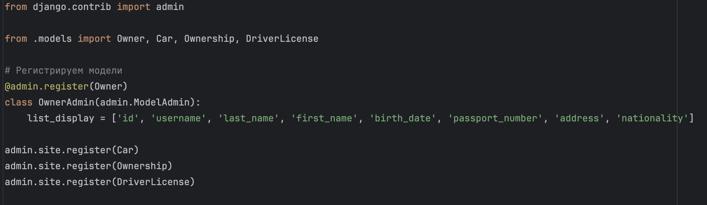
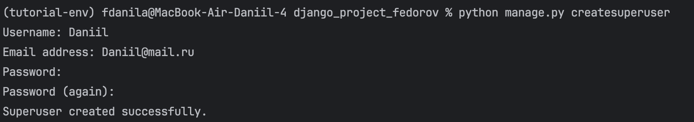
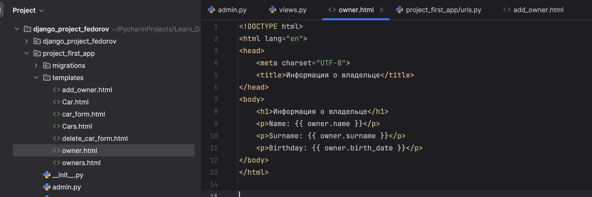
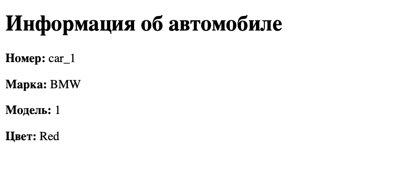
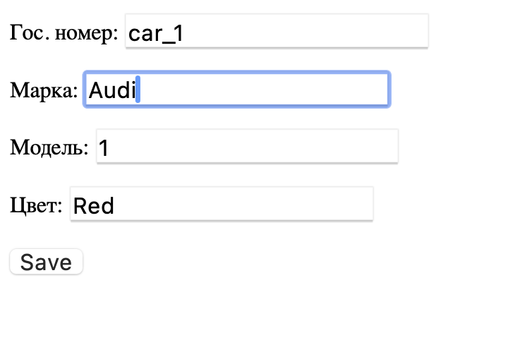
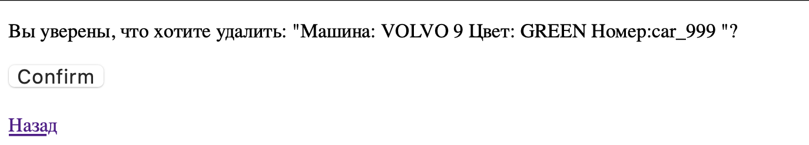
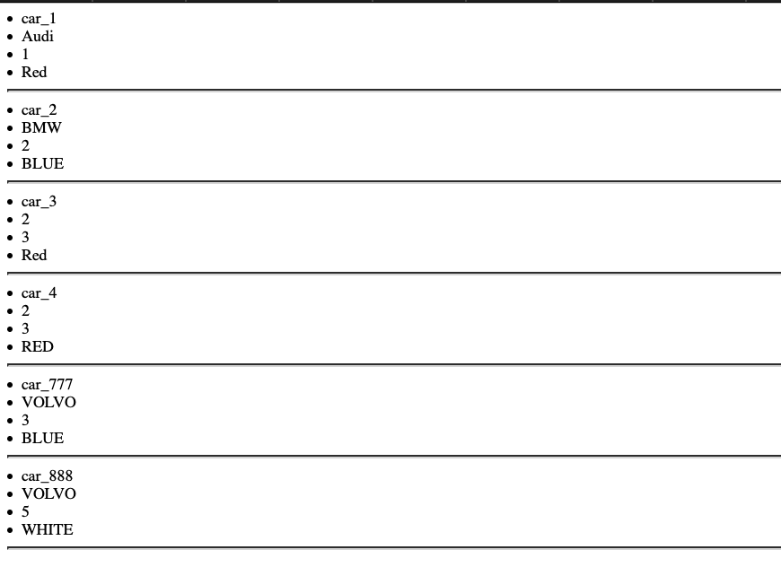
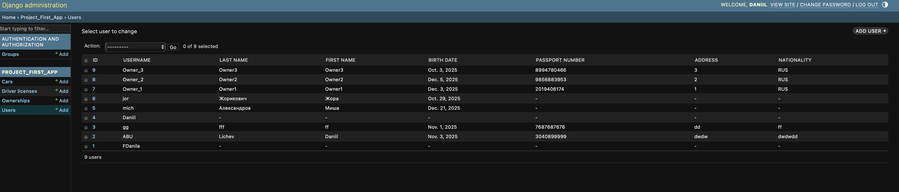
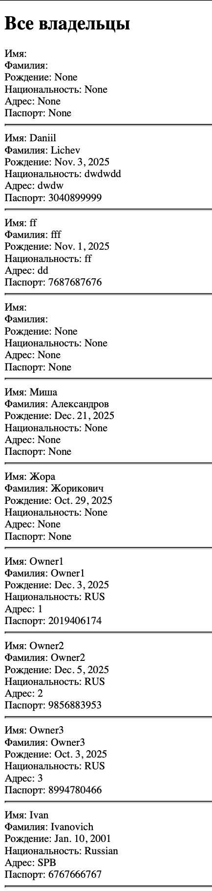

# Практическое занятие 2.1

## Практическое задание 1: Необходимо установить Django Web framework любым доступным способом.


Установил Django Web framework средствами командной строки в виртуальном окружении Python.


## Практическое задание 2.1: В проекте создать модель данных об автовладельцах в соответствии с рисунком 2.

```
from django.db import models
from django.contrib.auth.models import AbstractUser
from django.conf import settings

class Owner(AbstractUser):
    birth_date = models.DateField(null=True, blank=True)
    passport_number = models.CharField(max_length=10, null=True, blank=True)
    address = models.CharField(max_length=255, null=True, blank=True)
    nationality = models.CharField(max_length=100, null=True, blank=True)
    cars = models.ManyToManyField('Car', through='Ownership')

    def __str__(self):
        return f"{self.last_name} {self.first_name}"


class DriverLicense(models.Model):
    owner = models.ForeignKey(Owner, on_delete=models.CASCADE)
    license_number = models.CharField(max_length=10)
    license_type = models.CharField(max_length=10)
    issue_date = models.DateTimeField()

    class Meta:
        db_table = 'driver_license'

class Car(models.Model):
    plate_number = models.CharField(max_length=15)
    brand = models.CharField(max_length=20)
    model = models.CharField(max_length=20)
    color = models.CharField(max_length=30, null=True, blank=True)

    class Meta:
        db_table = 'car'

    def __str__(self):
        return (f'Машина: {self.brand} {self.model}\n'
                f'Цвет: {self.color}\n'
                f'Номер:{self.plate_number}\n')

class Ownership(models.Model):
    owner = models.ForeignKey(settings.AUTH_USER_MODEL, on_delete=models.CASCADE)
    car = models.ForeignKey(Car, on_delete=models.CASCADE)
    start_date = models.DateTimeField()
    end_date = models.DateTimeField(null=True, blank=True)

    class Meta:
        db_table = 'ownership'
```

Создал в `models.py` БД, с которой будем в дальнейшем взаимодействовать.
Так как отчет делал после того, как выполнил все проактические задачи, то БД немного отличается от той, что на картинке в самом задании.


## Практическое задание 2.2: Создать миграции и применить их к базе данных. 


Так как делаю в конце выполенения всех заданий, то миграций уже не выполнить, так как они были проделаны раньше.
Они сохранились в папке migrations


## Практическое задание 3: Необходимо заполнить таблицы данными средствами админ-панели.
Зарегистрировать владельца авто в админ-панели, а так же зарегистрировать остальные таблицы модели данных в админ-панели.



### 3.2 Создать суперпользователя командой:



### 3.3 Запустить сервер командой:


### 3.4 Добавить двух владельцев автомобилей, 4 автомобиля. Далее связать каждого владельца минимум с тремя автомобилями, так, чтобы не было пересечений по датам владения и продажи.

Ещё раз повторюсь, так как отчет делал в самую последнюю очередь, то бд изменилась вследствии других заданий.


Создали 2 пользователей-владельцев


Создали 4 машины


Привязали автомобили к владельцам с непересекающимися датами владения.


## Практическое задание 4: Создать в файле views.py (находится в папке приложения) представление (контроллер), который выводит из базы данных данные о владельце автомобиля. 


### 4.2 Создать страницу html-шаблона owner.html в папке templates



## Практическое задание 5:

Создадим `urls.py` и созадим такой адрес, который сможет задействовать наш созданный в предыдущем задании контролер. 


Теперь откроем поличившеюся страницу


# Практическое занятие №2.2

## Практическое задание 1: Правильно настроить связь между автомобилем, владением и владельцем.

```
from django.db import models
from django.contrib.auth.models import AbstractUser
from django.conf import settings

class Owner(AbstractUser):
    birth_date = models.DateField(null=True, blank=True)
    passport_number = models.CharField(max_length=10, null=True, blank=True)
    address = models.CharField(max_length=255, null=True, blank=True)
    nationality = models.CharField(max_length=100, null=True, blank=True)
    cars = models.ManyToManyField('Car', through='Ownership')

    def __str__(self):
        return f"{self.last_name} {self.first_name}"


class DriverLicense(models.Model):
    owner = models.ForeignKey(Owner, on_delete=models.CASCADE)
    license_number = models.CharField(max_length=10)
    license_type = models.CharField(max_length=10)
    issue_date = models.DateTimeField()

    class Meta:
        db_table = 'driver_license'

class Car(models.Model):
    plate_number = models.CharField(max_length=15)
    brand = models.CharField(max_length=20)
    model = models.CharField(max_length=20)
    color = models.CharField(max_length=30, null=True, blank=True)

    class Meta:
        db_table = 'car'

    def __str__(self):
        return (f'Машина: {self.brand} {self.model}\n'
                f'Цвет: {self.color}\n'
                f'Номер:{self.plate_number}\n')

class Ownership(models.Model):
    owner = models.ForeignKey(settings.AUTH_USER_MODEL, on_delete=models.CASCADE)
    car = models.ForeignKey(Car, on_delete=models.CASCADE)
    start_date = models.DateTimeField()
    end_date = models.DateTimeField(null=True, blank=True)

    class Meta:
        db_table = 'ownership'
```


Я реализовал связь «многие-ко-многим» между моделями `Owner` и `Car` через промежуточную модель `Ownership`, используя параметр `through`.
Модель `Ownership` содержит внешние ключи на владельца и автомобиль и хранит дополнительные данные о периоде владения.

## Практическое задание (по задаче 2): 

### Реализовать вывод всех владельцев функционально. Добавить данные минимум от трех владельцах. Должны быть реализованы контроллер (views) и шаблоны (temlates).

Функция вывода всех владельцев

```
    def all_owners(request):
        data = {
            'dataset' : Owner.objects.all()
        }

        return render(request, 'owners.html', context=data)
```

Так выглядит шаблон templates


И по адресу `http://127.0.0.1:8000/owners/` мы можем посмотреть всех пользователей


### Реализовать вывод всех автомобилей, вывод автомобиля по id, обновления на основе классов. Добавить данные минимум о трех автомобилях. Должны быть реализованы контроллер (views) и шаблоны (temlates).

Классы:

```
    class all_cars(ListView):
        model = Car
        template_name = 'Cars.html'

    class one_car(DetailView):
        model = Car
        template_name = 'Car.html'


    class update_car(UpdateView):
        model = Car
        template_name = 'car_form.html'
        fields = ['plate_number', 'brand', 'model', 'color']
        success_url = reverse_lazy('cars')
```

* `all_cars(ListView)` - вывод всех автомобилей, шаблон `Cars.html`
* `one_car(DetailView)` - вывод автомобиля по `pk`, шаблон `Car.html`
* `update_car(UpdateView)` - обновление авто по `pk`, шаблон `car_form.html`, поля: `plate_number`, `brand`, `model`, `color`

Cars.html - вывод всех машин по адресу `path('cars/', views.all_cars.as_view(), name='cars')`

```
    <!DOCTYPE html>
    <html lang="en">
    <head>
        <meta charset="UTF-8">
        <title>Все машины</title>
    </head>
    <body>
        
            <li>{{ object.plate_number }}</li>
            <li>{{ object.brand }}</li>
            <li>{{ object.model }}</li>
            <li>{{ object.color }}</li>
            <hr/>
        
            <li>No objects yet.</li>
        

    </body>
    </html>
```

Страница:


Car.html - вывод информации об одном автомобиле по адресу `path('car/<int:pk>', views.one_car.as_view())`

```
    <!DOCTYPE html>
    <html lang="en">
    <head>
        <meta charset="UTF-8">
        <title>Автомобиль</title>
    </head>
    <body>
        <h1>Информация об автомобиле</h1>
        <p><strong>Номер:</strong> {{ car.plate_number }}</p>
        <p><strong>Марка:</strong> {{ car.brand }}</p>
        <p><strong>Модель:</strong> {{ car.model }}</p>
        <p><strong>Цвет:</strong> {{ car.color }}</p>

    </body>
    </html>
```

Страница:




car_form.html - форма для обновления информаци о машине по адресу `path('car/<int:pk>/update', views.update_car.as_view())`

```
    <!DOCTYPE html>
    <html lang="en">
    <head>
        <meta charset="UTF-8">
        <title>Обновление данных о машине</title>
    </head>
    <body>
        <form method="post">
        {{ form.as_p }}
        <input type="submit" value="Save">
        </form>
    </body>
    </html>
```

Страница: 


обновим данные о первой машине:


## Практическое задание (по задаче 3)

### Реализовать форму ввода всех владельцев функционально. Добавить данные минимум о еще трех владельцах. Должны быть реализованы форма (Form), контроллер (views) и шаблоны (temlates)

Функция

```
    def create_owner(request):
        if request.method == 'POST':
            form = add_owner(request.POST)
            if form.is_valid():
                form.save()
                return redirect('owners_list')
        else:
            form = add_owner()
        return render(request, 'add_owner.html', {'form': form})
```

Форма

```
    class add_owner(forms.ModelForm):
        class Meta:
            model = Owner
            fields = ['username', 'password', 'first_name', 'last_name', 'birth_date', 'passport_number', 'address', 'nationality']
            widgets = {
                'birth_date': forms.DateInput(attrs={'type': 'date'})
            }
        
```

add_owner.html - страница с формой для добавления пользователя, доступная по адресу `path('owner_form/', views.create_owner)`

```
    <!DOCTYPE html>
    <html lang="en">
    <head>
        <meta charset="UTF-8">
        <title>Запись нового владельца</title>
    </head>
    <body>
        <h1>Добавить нового владельца</h1>
        <form method="post">
            
            {{ form.as_p }}
            <button type="submit">Добавить владельца</button>

    </body>
    </html>
```


Добавим 3 новых пользователей


### Реализовать форму ввода, обновления и удаления всех автомобилей на основе классов. Добавить данные минимум о еще трех автомобилях. Должны быть реализованы  форма (Form), контроллер (views) и шаблоны (temlates).

Вьюшки

```
    class update_car(UpdateView):
        model = Car
        form_class = CarForm
        template_name = 'car_form.html'
        success_url = reverse_lazy('cars')


    class add_car(CreateView):
        model = Car
        form_class = CarForm
        template_name = 'car_form.html'
        success_url = reverse_lazy('cars')


    class delete_car(DeleteView):
        model = Car
        template_name = 'delete_car_form.html'
        success_url = reverse_lazy('cars')
```

Форма для `add_car` и `update_car`

```
    class CarForm(forms.ModelForm):
        class Meta:
            model = Car
            fields = ['plate_number', 'brand', 'model', 'color']
            labels = {
                'plate_number': 'Гос. номер',
                'brand': 'Марка',
                'model': 'Модель',
                'color': 'Цвет',
            }
```

`add_car` и `update_car` используют одну форму и html шаблон по адресам `path('car/add/', views.add_car.as_view())` и `path('car/<int:pk>/update', views.update_car.as_view())` соответственно.

```
    <!DOCTYPE html>
    <html lang="en">
    <head>
        <meta charset="UTF-8">
        <title>Обновление данных о машине</title>
    </head>
    <body>
        <form method="post">
        {{ form.as_p }}
        <input type="submit" value="Save">
        </form>
    </body>
    </html>
```

Удаление машины доступно по адресу `path('car/<int:pk>/delete/', views.delete_car.as_view())`

```
    <!DOCTYPE html>
    <html lang="en">
    <head>
     <meta charset="UTF-8">
     <meta name="viewport" content="width=device-width, initial-scale=1.0">
     <title>Удалить машину</title>
    </head>

    <body>
      <form method="post">
        <p>Вы уверены, что хотите удалить: "{{ object }}"?</p>
        <input type="submit" value="Confirm">
      </form>
      <br>
      <a href="">Назад</a>
    </body>
    </html>
```

Изменим машину




Добавим новые машины


Так добавим 3 машины


Удалим последнюю машину





# Практическое занятие №3
## Практическое задание: сделать “Владельца автомобиля” пользователем и расширить  модель пользователя его атрибутами, так, чтобы о нем хранилась следующая информация: 

* номер паспорта;
* домашний адрес;
* национальность. 

Отобразить новые поля пользователя в Django Admin. Отредактировать код из предыдущих работ, так, чтобы выводилась информация о пользователях.
Реализовать интерфейс создания пользователя с новыми атрибутами.

* Была создана создана кастомная модель пользователя `Owner` на основе `AbstractUser`, добавлены поля: `passport_number`, `address`, `nationality`.

```
    class Owner(AbstractUser):
        birth_date = models.DateField(null=True, blank=True)
        passport_number = models.CharField(max_length=10, null=True, blank=True)
        address = models.CharField(max_length=255, null=True, blank=True)
        nationality = models.CharField(max_length=100, null=True, blank=True)
        cars = models.ManyToManyField('Car', through='Ownership')

        def __str__(self):
            return f"{self.last_name} {self.first_name}"
```

Новые поля отображаются в Django Admin.

```
    from django.contrib import admin

    from .models import Owner, Car, Ownership, DriverLicense

    @admin.register(Owner)
    class OwnerAdmin(admin.ModelAdmin):
        list_display = ['id', 'username', 'last_name', 'first_name', 'birth_date', 'passport_number', 'address', 'nationality']
```



Так же внес в `settings.py`

```
    AUTH_USER_MODEL = 'project_first_app.Owner'
```

Реализована форма создания пользователя с новыми атрибутами

```
    class add_owner(forms.ModelForm):
    class Meta:
        model = Owner
        fields = ['username', 'password', 'first_name', 'last_name', 'birth_date', 'passport_number', 'address', 'nationality']
        widgets = {
            'birth_date': forms.DateInput(attrs={'type': 'date'})
        }
```

Реализован шаблон add_owner.html доступный по адресу `path('owner_form/', views.create_owner)`

```
    <!DOCTYPE html>
    <html lang="en">
    <head>
        <meta charset="UTF-8">
        <title>Запись нового владельца</title>
    </head>
    <body>
        <h1>Добавить нового владельца</h1>
        <form method="post">
            
            {{ form.as_p }}
            <button type="submit">Добавить владельца</button>
        </form>

    </body>
    </html>
```

Так же теперь на страницах owner.html и owners.html отображаются новые данные


owner.html
```
    <!DOCTYPE html>
    <html lang="en">
    <head>
        <meta charset="UTF-8">
        <title>Информация о владельце</title>
    </head>
    <body>
        <h1>Информация о владельце</h1>
        <p>Name: {{ owner.first_name }}</p>
        <p>Surname: {{ owner.last_name }}</p>
        <p>Birthday: {{ owner.birth_date }}</p>
        <p>Nationality: {{ owner.nationality }}</p>
        <p>Address: {{ owner.address }}</p>
        <p>Passport: {{ owner.passport_number }}</p>
    </body>
    </html>

```

owners.html

```
    <!DOCTYPE html>
    <html lang="en">
    <head>
        <meta charset="UTF-8">
        <title>Владельцы</title>
    </head>
    <body>
        <h1>Все владельцы</h1>

            
            Имя: {{owner.first_name}}<br/>
            Фамилия: {{owner.last_name}}<br/>
            Рождение: {{owner.birth_date}}<br/>
            Национальность: {{ owner.nationality }}<br/>
            Адрес: {{ owner.address }}<br/>
            Паспорт: {{ owner.passport_number }}<br/>
            <hr/>

            

    </body>
    </html>
```

Добавим нового пользователя и посмотрим как он будет отображаться





